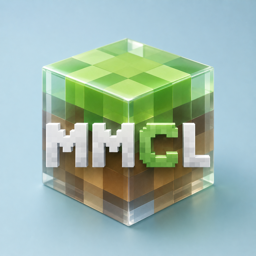
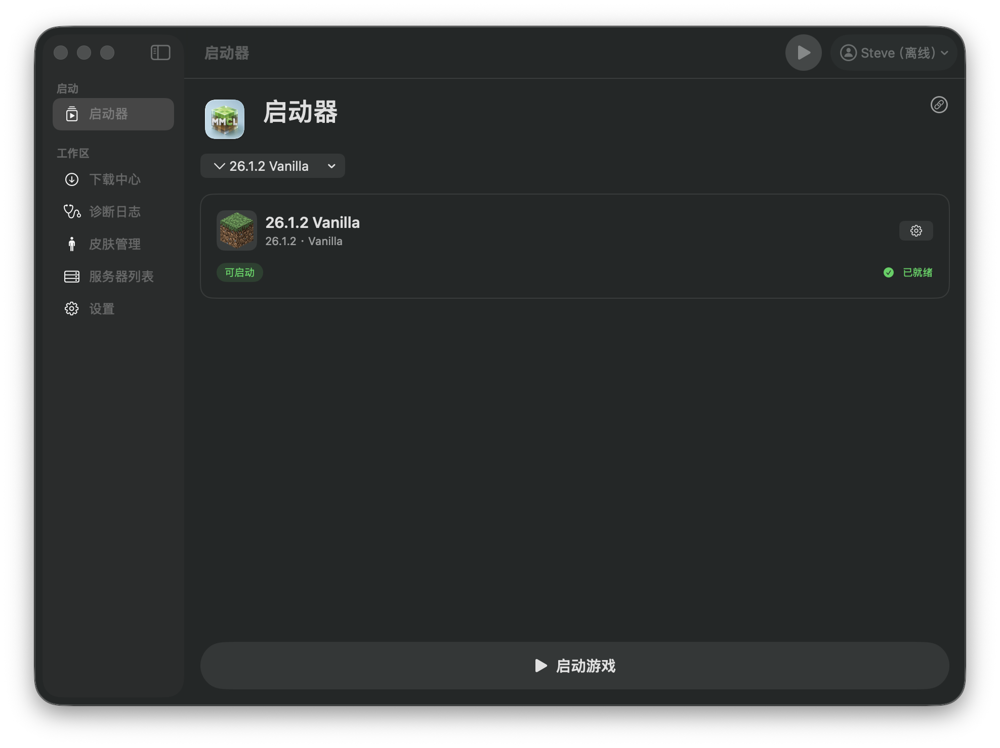
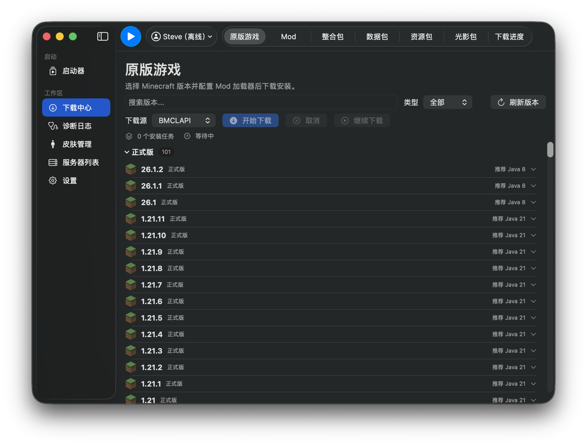

<div align="center">

<h1 align="center">MMCL 🎮</h1>

<p align="center">
  <a href="https://github.com/Lhy723/MMCL/stargazers"></a>
  <a href="https://github.com/Lhy723/MMCL/issues"></a>
  <a href="https://github.com/Lhy723/MMCL/network/members"></a>
  <a href="https://github.com/Lhy723/MMCL/blob/main/LICENSE"></a>
</p>
<br>

macOS 原生 Minecraft 启动器，基于 SwiftUI 构建，参考 PCL 交互设计。
支持 版本管理、Mod/资源包/光影包管理、Modrinth/CurseForge 搜索下载、Microsoft 账号登录、多实例管理。

<br>

<h4>启动页</h4>



<h4>下载中心</h4>



</div>

## 功能特性 🎯

- [x] **macOS 原生体验**，基于 SwiftUI + macOS 26 Liquid Glass 设计
- [x] **多实例管理**，支持创建、复制、重命名、删除实例
- [x] **版本管理**，支持 Vanilla、Fabric、Quilt、Forge、NeoForge
- [x] **Mod 管理**，本地启用/禁用/删除，支持 .jar/.disabled 切换
- [x] **资源包管理**，支持 .zip 资源包的启用/禁用/删除
- [x] **光影包管理**，支持光影包的启用/禁用/删除
- [x] **Modrinth 搜索**，支持 Mod、Modpack、资源包、光影包、数据包搜索下载
- [x] **CurseForge 搜索**，支持 Mod 搜索（需配置 API Key）
- [x] **Microsoft 账号登录**，支持 OAuth 设备码流程
- [x] **离线账号**，支持自定义用户名
- [x] **Java 管理**，自动扫描系统 Java，支持一键安装便携版 JDK
- [x] **下载管理**，并发下载、暂停/继续/取消、实时速度显示
- [x] **日志查看器**，实时查看游戏启动日志
- [x] **崩溃分析**，自动检测 Java 版本不匹配、崩溃日志分析
- [x] **皮肤管理**，支持皮肤导入、预览、切换
- [x] **服务器列表**，多人游戏服务器管理
- [x] **自定义背景**，支持自定义启动器背景图片
- [x] **多语言**，支持中文界面
- [x] **自动更新**，支持从 GitHub Releases 检查更新

## 系统要求 📦

| 项目 | 要求 |
| --- | --- |
| 系统 | macOS 14.0 (Sonoma) 或更高 |
| 架构 | Apple Silicon (arm64) 或 Intel (x86_64) |
| Xcode | 16.0 或更高（构建需要） |
| Java | 自动检测，或通过设置页一键安装 |

## 快速开始 🚀

### 方式一：下载 Release

1. 前往 [Releases](https://github.com/Lhy723/MMCL/releases) 下载最新 `.dmg`
2. 双击打开，拖入 Applications 文件夹
3. 首次打开可能需要在「系统设置 → 隐私与安全性」中允许

### 方式二：从源码构建

```shell
# 克隆仓库
git clone https://github.com/Lhy723/MMCL.git
cd MMCL

# 构建
xcodebuild build -project MMCL.xcodeproj -scheme MMCL -destination 'platform=macOS'

# 或使用脚本构建并运行
./script/build_and_run.sh
```

## 使用指南 📖

### 创建实例

1. 打开启动器，点击侧边栏「下载中心」
2. 在「原版游戏」标签页选择 Minecraft 版本
3. 可选：选择 Mod 加载器（Forge / Fabric / Quilt / NeoForge）
4. 点击「开始下载」，等待下载完成

### 安装 Java

如果启动器未检测到 Java：

1. 打开「设置 → 游戏 Java」
2. 点击「安装 Java」
3. 选择版本（推荐 Java 21），点击安装
4. 便携版 JDK 会自动下载到本地目录

### 下载 Mod

1. 点击侧边栏「下载中心」→「Mod」标签
2. 搜索想要的 Mod
3. 点击「安装」，选择版本后自动下载到当前实例

### CurseForge 支持

CurseForge 需要单独的 API Key：

1. 前往 [CurseForge Console](https://console.curseforge.com/) 注册并获取 API Key
2. 打开「设置 → 其他」，输入 API Key
3. 搜索时选择 CurseForge 来源即可

## 项目结构 📁

```
MMCL/
├── Models/         # 数据模型
├── Services/       # 服务层（下载、版本管理、Java、Modrinth API 等）
├── Stores/         # 状态管理（LauncherStore）
├── Views/          # UI 视图
│   ├── download/   # 下载中心相关视图
│   └── ...
├── Assets.xcassets # 图标资源
└── MMCLApp.swift   # 应用入口
```

## 架构说明 🏗

采用 **Models → Services → Store → Views** 分层架构：

- **Models**：所有数据类型定义（`LauncherInstance`、`DownloadJob`、`JavaRuntime` 等）
- **Services**：协议化服务层，支持依赖注入和 Mock 测试
- **Store**：单一 `ObservableObject`，管理所有应用状态
- **Views**：SwiftUI 视图，`NavigationSplitView` 布局

## 测试 🧪

```shell
# 运行所有测试
xcodebuild test -project MMCL.xcodeproj -scheme MMCL -destination 'platform=macOS'

# 运行单个测试类
xcodebuild test -project MMCL.xcodeproj -scheme MMCL -destination 'platform=macOS' \
  -only-testing:MMCLTests/LauncherStoreTests
```

## 下载源 🌐

支持多种下载源，可在设置中切换：

| 来源 | 说明 |
| --- | --- |
| 官方 | Mojang 官方服务器 |
| BMCLAPI | 国内镜像加速 |
| 自定义 | 自定义镜像地址 |

## 致谢 🙏

- [PCL (Plain Craft Launcher)](https://github.com/Meloong-Git/PCL) — 交互设计参考
- [Modrinth](https://modrinth.com/) — Mod 搜索 API
- [CurseForge](https://www.curseforge.com/) — Mod 搜索 API
- [Adoptium](https://adoptium.net/) — 便携版 JDK 下载

## Star 趋势 ⭐

[](https://star-history.com/#Lhy723/MMCL&Date)

## 许可证 📄

[MIT License](LICENSE)
